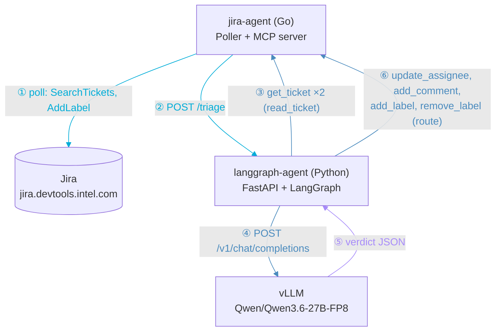

# Jira Triage Agent

An automated triage system for AI-generated Jira tickets. It polls Jira every hour for tickets labelled `ai-generated`, uses an LLM to classify them as spam or actionable, then either reassigns spam back to the reporter with a polite comment or routes valid tickets to team members via round-robin.

## What It Does

```
Jira ticket with label "ai-generated"
          │
          ▼
  jira-agent (Go) polls every 1h
          │
          ▼
  LangGraph triage workflow (Python)
          │
          ├─ SpamEvaluator (LLM) ──► is_spam?
          │
          ├─ SPAM → reassign to reporter + comment explaining why
          │
          └─ VALID → assign to next team member (round-robin)
          │
          ▼
  stamp label "triage-agent-done" (prevents re-processing)
```

**Spam criteria** (evaluated by LLM):
- No Jenkins build link in the ticket
- No server/node name mentioned
- Issue is out of scope: hardware, firmware, kernel, IT, non-K8s networking

## Architecture

| Component | Language | Role |
|---|---|---|
| **jira-agent** | Go | Polls Jira, exposes MCP tools, dispatches to LangGraph |
| **langgraph-agent** | Python | LangGraph workflow: read → evaluate → route |
| **vLLM** | — | Self-hosted LLM inference on Intel Gaudi |

### Component map — who calls who

Numbers are chronological order for one ticket. Color = who initiates the call. Full interactive version (animated, click-to-preview spam/valid branches) at [docs/architecture/flow-explainer.html](docs/architecture/flow-explainer.html).



### LangGraph Workflow

```
initialize → read_ticket → evaluate → route → END
```

- `read_ticket` — fetches ticket content and reporter via Jira MCP
- `evaluate` — calls `SpamEvaluator` (LLM returns structured JSON verdict)
- `route` — calls `TicketRouter` (assigns + comments + stamps label)

### MCP Tools (Go → Python)

The Go monolith exposes a Jira MCP server at `/mcp/jira`.

**Used by the live triage workflow** (`read_ticket`/`route`):

| Tool | Description |
|---|---|
| `get_ticket` | Fetch ticket details (summary, description, reporter, comments) |
| `add_comment` | Post a comment to a ticket |
| `add_label` | Add a label to a ticket |
| `remove_label` | Remove a label from a ticket — clears `triage-in-progress` once a ticket is actually triaged |
| `update_assignee` | Assign ticket to a user (Jira Server username) |

**Available, not yet called by the automated flow** (usable for manual/future use):

| Tool | Description |
|---|---|
| `search_tickets` | Search tickets via JQL |
| `create_issue` | Open a new ticket (project, issue type, summary, description). Note: some projects require additional fields (e.g. custom fields, components) beyond these — Jira's own error response names them if so, since this instance's `createmeta` endpoint wasn't reachable to pre-validate. |
| `resolve_issue` | Transition a ticket to Resolved. Looks up the transition ID dynamically via the transitions endpoint rather than assuming a fixed one, since the same target status can have a different transition ID depending on the ticket's current status. |
| `update_issue` | Update a ticket's summary and/or description |

### HTTP Endpoints (jira-agent)

| Endpoint | Method | Description |
|---|---|---|
| `/health` | GET | Liveness check |
| `/ready` | GET | Readiness check |
| `/mcp/jira` | POST | MCP tool server (see above) |
| `/poll` | POST | Trigger a poll cycle immediately (`202 Accepted`, runs in the background) — instead of waiting for the next hourly tick or restarting the pod |

## Configuration

All tunable options live in **one file**:

### [`deploy/base/triage-config.yaml`](deploy/base/triage-config.yaml)

```yaml
# Jira filters — which tickets to pick up
FILTER_PROJECT: "GAUDISW"
FILTER_COMPONENT: "DevOps_K8S"
FILTER_ISSUE_TYPE: ""          # empty = Bug + Task

# Triage team — round-robin assignment
TEAM_MEMBERS: "user1,user2,user3"
PROCESSED_LABEL: "triage-agent-done"

# Polling
POLLING_INTERVAL: "1h"
MAX_CONCURRENT_DISPATCHES: "5"

# LLM
VLLM_MODEL_NAME: "Qwen/Qwen3.6-27B-FP8"
VLLM_ENDPOINT: "http://vllm-service:8000/v1"

# LangSmith observability (set LANGCHAIN_API_KEY in secret to enable)
LANGCHAIN_TRACING_V2: "false"
LANGCHAIN_PROJECT: "jira-triage-agent"
```

Both the Go agent and the Python agent read from this ConfigMap. The vLLM server also picks up `VLLM_MODEL_NAME` from it via the `--model=$(VLLM_MODEL_NAME)` arg.

## Image Management

Each component's image tag is managed in its own `kustomization.yaml` — one line to change:

**vLLM** → [`deploy/base/llm-serving/kustomization.yaml`](deploy/base/llm-serving/kustomization.yaml)
```yaml
images:
  - name: vllm-gaudi
    newName: artifactory-kfs.iil.labsad.intel.com/docker-developers/users/qauser/vllm_pytorch_synapse_nightly/1.24.1/ubuntu24.04/vllm-main/ptfork-2.12.0
    newTag: "1.24.1_396"   # ← change this
```

**Go agent** → [`deploy/base/jira-agent/kustomization.yaml`](deploy/base/jira-agent/kustomization.yaml)
```yaml
images:
  - name: jira-triage-agent
    newName: <your-registry>/jira-triage-agent
    newTag: "latest"       # ← change this
```

**Python agent** → [`deploy/base/langgraph-agent/kustomization.yaml`](deploy/base/langgraph-agent/kustomization.yaml)
```yaml
images:
  - name: jira-triage-langgraph
    newName: <your-registry>/jira-triage-langgraph
    newTag: "latest"       # ← change this
```

> To find the latest vLLM nightly build, browse:
> `artifactory-kfs.iil.labsad.intel.com → docker-developers/users/qauser/vllm_pytorch_synapse_nightly/1.24.1/ubuntu24.04/vllm-main/ptfork-2.12.0/`

## LLM

**Current model**: [`Qwen/Qwen3.6-27B-FP8`](https://hf.co/Qwen/Qwen3.6-27B-FP8)

| Property | Value |
|---|---|
| Architecture | Dense |
| Parameters | 27B (all active) |
| Quantization | FP8 (~27GB weights) |
| Gaudi cards required | 1 |
| Origin | Alibaba (open-source, Apache 2.0) |
| Released | April 2026 |

Runs on **Intel Gaudi** via the vLLM Gaudi hardware plugin (`vllm-gaudi`). Chain-of-thought reasoning is disabled for faster triage inference by passing `chat_template_kwargs={"enable_thinking": false}` on each request (the prompt-level `/no_think` directive is ignored by Qwen3.6 on this build).

## Deployment

### 1. Create the secret

```bash
kubectl create secret generic jira-triage-agent-secret \
  --from-literal=jira-url=https://jira.devtools.intel.com \
  --from-literal=jira-api-token=<your-jira-api-token> \
  -n jira-k8s-agent
```

The Jira PAT uses Bearer token auth (`Authorization: Bearer <PAT>`) — correct for self-hosted Jira Server 8.14+. No username needed.

Optional keys in the same secret:
- `langchain-api-key` — enables LangSmith tracing
- `huggingface-token` — needed if model is not already cached

### 2. Build and push images

```bash
# Go monolith
make build
docker push <your-registry>/jira-triage-agent:latest

# Python agent
cd langgraph-agent
docker build -t <your-registry>/jira-triage-langgraph:latest .
docker push <your-registry>/jira-triage-langgraph:latest
```

### 3. Deploy

```bash
kubectl apply -k deploy/base/
```

### 4. Verify

```bash
kubectl get pods -n jira-k8s-agent
kubectl logs -l app=jira-agent -n jira-k8s-agent -f
kubectl logs -l app=langgraph-agent -n jira-k8s-agent -f
kubectl logs -l app=vllm-qwen3 -n jira-k8s-agent -f
```

## Jira Labels Used

| Label | Meaning |
|---|---|
| `ai-generated` | Trigger — agent picks up tickets with this label |
| `triage-in-progress` | Guard — prevents duplicate processing |
| `triage-agent-done` | Done — ticket has been triaged, won't be picked up again |

## Repository Structure

```
jira-triage-agent/
├── cmd/jira-agent/         # Go entrypoint (config, main)
├── pkg/
│   ├── mcp/jira/           # Jira MCP server + client (Go)
│   ├── poller/             # Jira polling logic (Go)
│   └── health/             # Health/ready handlers (Go)
│
├── langgraph-agent/src/
│   ├── agents/
│   │   ├── spam_evaluator.py   # LLM-based spam classification
│   │   └── ticket_router.py    # Assigns and labels tickets
│   ├── tools/jira_tools.py     # MCP client wrappers
│   ├── supervisor.py           # LangGraph workflow
│   ├── state.py                # Shared state definition
│   ├── config.py               # Settings (reads from env/ConfigMap)
│   └── server.py               # FastAPI /triage endpoint
│
└── deploy/base/
    ├── triage-config.yaml          # ← ALL tunable options here
    ├── jira-agent/
    │   └── kustomization.yaml      # ← jira-agent image tag here
    ├── langgraph-agent/
    │   └── kustomization.yaml      # ← langgraph image tag here
    └── llm-serving/
        ├── kustomization.yaml      # ← vLLM image tag here
        └── vllm-deployment.yaml    # vLLM serving config (Gaudi)
```

## Go Tests

```bash
go test ./pkg/... ./cmd/...
```
